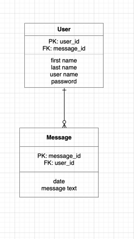
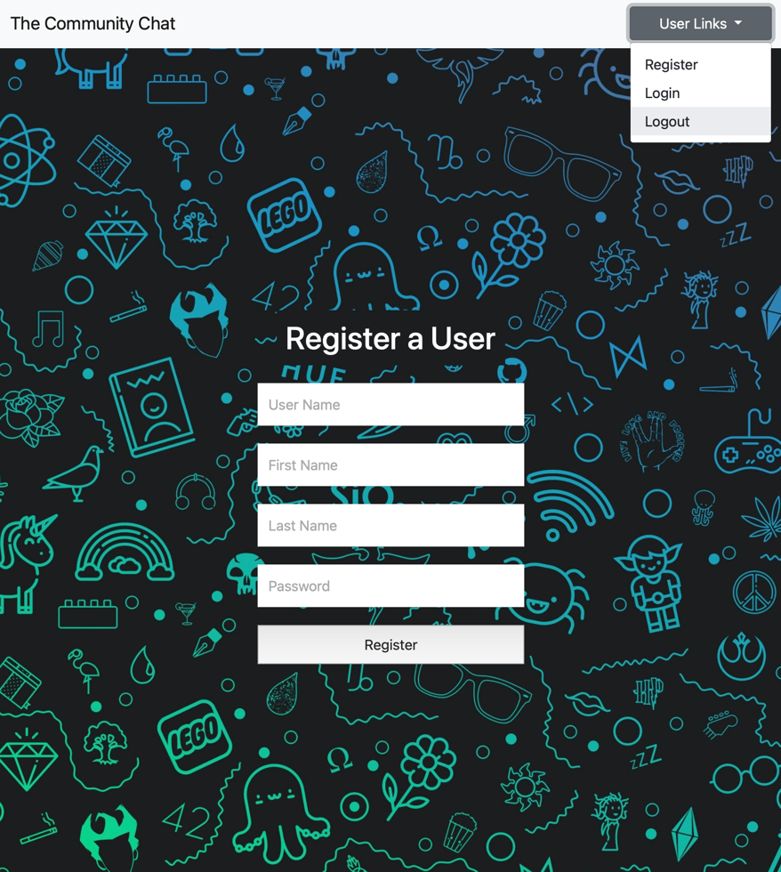
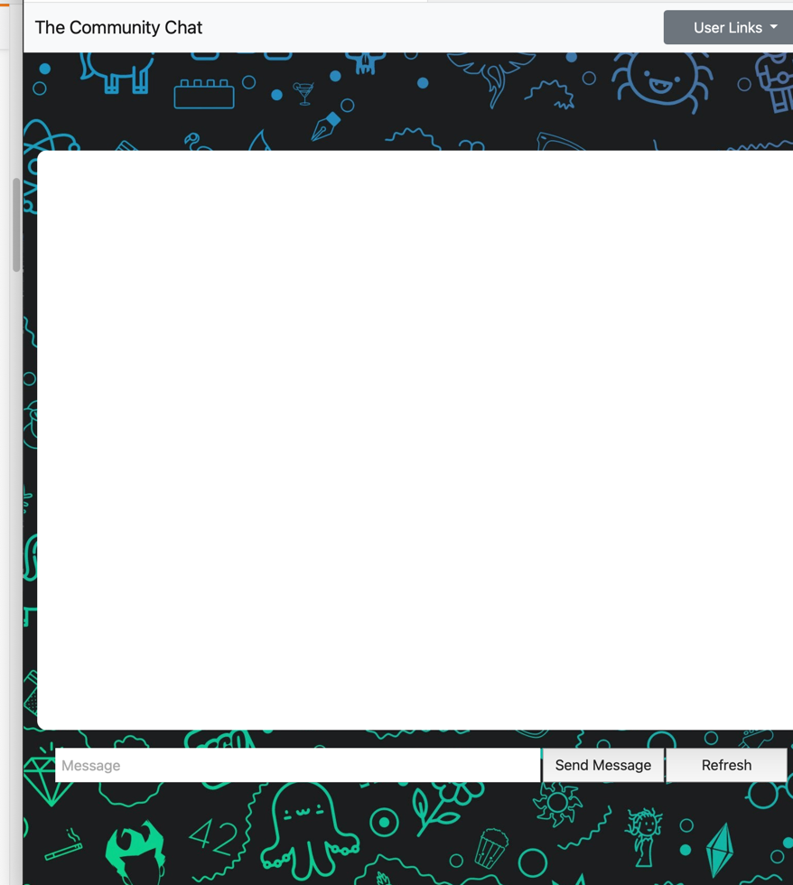

## Approach
At first, I planned on making a chat application backend using STOMP instead of REST/HTTP. 
Due to scalability, concurrency, and time constraints, I created my Springboot backend to work with
REST/HTTP.

After building and testing my backend, I used Angular to create the front end.  Most components could be grouped into two modules:
a chat module and user module.  I also have two service classes for chat messages and users.

## Full Stack Chat application
This full stack project will allow a user to create register, login, send and 
view messages anonymously from a community chat.  This could also double as an internal company chat/posting site too.

## User Stories
* As a User I want to register
* As a User I want to login
* As a User I want to Create, Send, and view messages
* As a User, I want to logout

## Domain Models

## Application Sceenshots

--------------
## Application Set-Up
* Dependencies:
    * Spring v2.4.5
    * PostgreSQL v13.2
    * Angular v11.2.10
    * Node 14.15.5
  
* Springboot set up
    * application.properties
    * application-dev.properties
    * pom.xml maven dependencies
    * Models
    * Repositories
    * Security & Users
    * Service Layer
    * Exception Handling
    * Message broker
    * WebSocket Configurer
* Database setup
* Project Structure
* GitHub setup
* Angular Setup
  * Components
  * Modules
  * Routing
  * Services
  * Authentication & login
* Heroku setup
* Readme

--------------
## Progress

- [X] Backend
  - [X] Models
  - [X] REST
  - [X] Services
  - [X] REST Controller
  - [X] Exceptions
  - [X] Repos
  - [X] Update pom.xml 
  - [X] Update resources folder
  - [X] Postman testing

- [X] Frontend
  - [X] Services
  - [X] Components
  - [X] Modules
  - [X] Routing
  - [X] Styling
  - [X] CRUD

- [X] Deployment on Heroku

